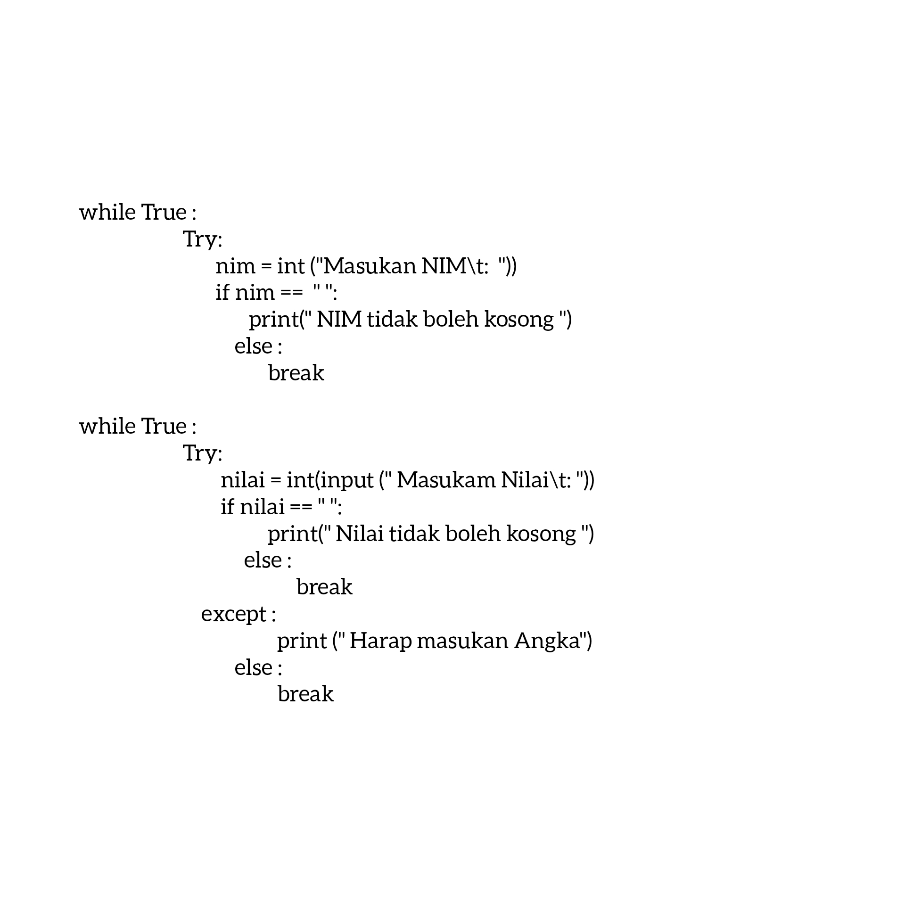
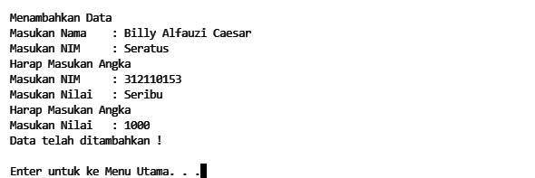

# Praktikum9
## Kode Eksepsinya

Dengan menambahkan Eksepsi maka, ketika input data kosong akan diminta memasukkan data kembali & saat input NIM menggunakan huruf atau karakter maka program otomatis akan meminta untuk memasukkan angka.

### Kurang lebih seperti ini tampilan nya

### Panjang Umur Untuk Semua Hal-hal Baik :)